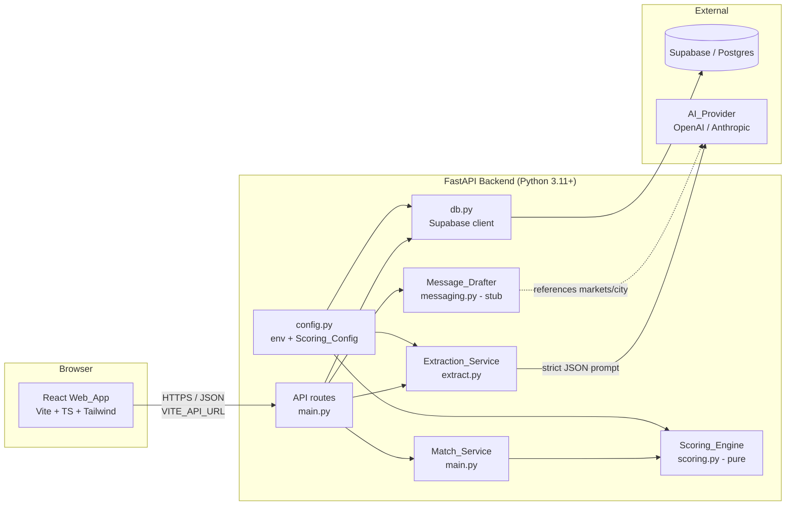
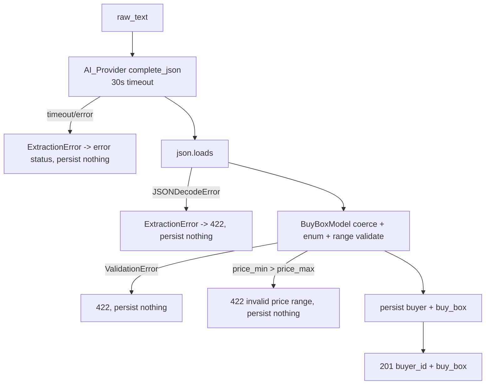

# Design Document

## Overview

BuyBox Matcher is a two-screen web application for real-estate wholesaling/disposition. It converts free-text investor messages into structured purchase criteria ("buy boxes") and scores a property deal against every saved buyer, returning a ranked, explainable list of matches.

The design is organized around one central principle taken straight from the requirements: **AI lives only at the edges, and the match decision is a pure, deterministic function.** Extraction (fuzzy text → structured data) and message drafting (structured data → human phrasing) are the only places an AI_Provider is called. The Scoring_Engine — the part a wholesaler must trust — is a rule-based, weighted, side-effect-free function whose every point is traceable to a rule.

This shape produces three concrete benefits that drive the rest of the design:

- **Explainability.** Each score ships with the `fit`/`risk` reasons that produced it. There is no black box on the path that ranks buyers.
- **Testability.** Because `score(property, buy_box)` performs no I/O and depends on no mutable state, it can be exhaustively exercised with property-based testing. This is why the Correctness Properties section below is substantial.
- **Future learned-model swap.** All weights and thresholds live in a single `Scoring_Config` object. When closed-deal outcomes eventually exist, the rule-based weights can be replaced with learned weights without touching the orchestration, persistence, or API layers.

### Key Design Decisions

| Decision | Rationale | Requirements |
|----------|-----------|--------------|
| Rule-based deterministic scoring (not a learned model) | No labelled outcome data exists on day one; a wholesaler trusts traceable rules; weights are easy to tune | 2.1, 2.2 |
| AI only at the edges (extract + draft) | Keeps the ranking decision inspectable; isolates non-determinism to two clearly bounded operations | 1.1, 8.1, 14.1 |
| Pure scoring function with config-driven weights | Trivially testable, drift-free, and a drop-in seam for a future learned model | 2.1, 2.2 |
| Server-side-only AI calls | API keys never reach the browser; the frontend's only external reference is `VITE_API_URL` | 14.1, 14.2 |
| `Deal_ARV_Pct` computed at match time, never stored | It is a pure function of `price` and `arv` and must not drift out of sync | 5.1, 9.6 |
| Enums stored as text + app-level validation | Flexible during a tryout; promotable to Postgres enums once values stabilize | 9.5 |
| `buy_boxes` modelled as its own 1:1 table | A buyer could hold several buy boxes later without a schema migration | 9.2, 9.7 |
| Matches persisted (cached) | Results stay inspectable and repeatable | 9.4, 7.2 |

## Architecture

### System Shape

BuyBox Matcher is a two-tier application: a React frontend (Web_App), a FastAPI backend (API), and Postgres via Supabase. The AI_Provider (OpenAI or Anthropic) is reachable only from the backend.



The API is **stateless**: no sessions, no per-user partitioning (Requirement 15.2). Each request carries everything it needs, which keeps deployment and horizontal scaling simple.

### Request Flow: Extract

```mermaid
sequenceDiagram
    actor User
    participant Web as Extract_Screen
    participant API
    participant EXT as Extraction_Service
    participant AI as AI_Provider
    participant DB as Postgres

    User->>Web: paste raw_text (+ name, company)
    Web->>Web: validate non-whitespace (12.5)
    Web->>API: POST /buy-boxes/extract
    API->>API: validate body: raw_text 1..10000 chars (8, 10.1)
    alt raw_text missing/empty/whitespace
        API-->>Web: 422 raw_text required (1.8)
    else valid
        API->>EXT: extract(raw_text)
        EXT->>AI: strict-JSON extraction prompt (1.1)
        Note over EXT,AI: 30s timeout (1.9)
        AI-->>EXT: JSON candidate
        EXT->>EXT: Pydantic coerce + enum validate;<br/>null-for-absent (1.3-1.6)
        alt unparseable / provider error / timeout
            EXT-->>API: extraction failure
            API-->>Web: 422 / error, nothing persisted (1.7, 1.9)
        else price_min > price_max
            API-->>Web: 422 invalid price range (1.10)
        else valid Buy_Box
            API->>DB: insert buyer + buy_box (1:1)
            DB-->>API: buyer_id
            API-->>Web: 201 { buyer_id, buy_box } (1.11)
            Web->>User: show chips + save confirmation (12.3, 12.6)
        end
    end
```

### Request Flow: Match

```mermaid
sequenceDiagram
    actor User
    participant Web as Match_Screen
    participant API
    participant MS as Match_Service
    participant SC as Scoring_Engine
    participant DB as Postgres

    User->>Web: enter property; live ARV% display (13.2)
    Web->>API: POST /match?min_score=&limit=
    API->>API: validate query params (7.8) + body (10.8)
    alt invalid params/body
        API-->>Web: 422, nothing persisted (7.8, 10.8)
    else valid
        API->>DB: insert property (7.1)
        API->>DB: load all buyers + buy_boxes
        loop each buyer
            MS->>SC: score(property, buy_box)
            SC-->>MS: { score, reasons }
        end
        MS->>DB: persist matches (score + reasons) (7.2)
        MS->>MS: sort score desc, buyer_id asc (7.3)
        MS->>MS: apply min_score then limit (7.6, 7.7)
        API-->>Web: 200 { property_id, matches } (7.4, 7.5)
        Web->>User: ranked rows, color tiers, chips (13.4-13.8)
    end
```

### Backend Module Responsibilities

| File | Responsibility |
|------|----------------|
| `api/main.py` | FastAPI app construction, CORS middleware, route handlers, Match_Service orchestration |
| `api/scoring.py` | `score(property, buy_box) -> {score, reasons}` — the pure Scoring_Engine. No imports that perform I/O |
| `api/extract.py` | Extraction_Service: prompt assembly, AI_Provider call, JSON parsing, Pydantic coercion/validation |
| `api/messaging.py` | Message_Drafter stub: builds SMS draft text, never sends |
| `api/db.py` | Supabase client construction and typed query helpers (insert/select for the four tables) |
| `api/models.py` | Pydantic request/response models and internal dataclasses for Property / Buy_Box |
| `api/config.py` | Environment loading, startup credential validation, the `Scoring_Config` constant |
| `api/scripts/seed.py` | Synthetic seed generator (140-160 buyers) |
| `api/tests/test_scoring.py` | Per-criterion unit tests, full-property fixtures, and property-based tests |
| `api/requirements.txt` | Pinned Python dependencies |
| `api/.env.example` | Documented backend env vars (no real secrets) |

### Frontend Module Responsibilities

| File | Responsibility |
|------|----------------|
| `web/src/main.tsx` | React root render |
| `web/src/App.tsx` | Router: `/extract` and `/match` routes |
| `web/src/pages/ExtractPage.tsx` | Extract_Screen: message + name/company inputs, submit, chips, states |
| `web/src/pages/MatchPage.tsx` | Match_Screen: property form, ranked rows, draft modal, states |
| `web/src/components/BuyBoxCard.tsx` | Renders an extracted Buy_Box as labeled chips |
| `web/src/components/PropertyForm.tsx` | Property input form + live Deal_ARV_Pct display |
| `web/src/components/MatchRow.tsx` | One ranked match: score badge tier + fit/risk chips + draft control |
| `web/src/lib/api.ts` | Typed fetch client; reads `VITE_API_URL` |
| `web/src/types.ts` | Shared TypeScript types mirroring API response shapes |

## Components and Interfaces

### Scoring_Engine (`api/scoring.py`)

The heart of the system. A single pure function plus per-criterion helpers.

```python
def score(property: PropertyInput, buy_box: BuyBoxInput,
          config: ScoringConfig = SCORING_CONFIG) -> ScoreResult:
    """Pure: identical inputs -> identical outputs, no I/O, no mutation."""
```

Where:

```python
@dataclass(frozen=True)
class ScoreResult:
    score: int                 # 0..100 inclusive
    reasons: Reasons           # { fit: list[str], risk: list[str] }

@dataclass(frozen=True)
class Reasons:
    fit: list[str]
    risk: list[str]
```

**Invalid-input contract (Requirement 2.10).** Before scoring, the engine validates that `property` and `buy_box` are non-null and that the fields required for scoring (`property.city`, `property.property_type`, `buy_box.markets`) are present. If any are missing it returns an error indication (raises `ScoringInputError`) **without** producing a numeric score and **without** mutating its inputs. The Match_Service maps this to a skipped/zero-handling path; at the API layer malformed bodies surface as 422 (10.8).

**Algorithm.** The engine computes six independent component scores, sums them, then applies the hard-filter cap:

```
raw = market + strategy + price + arv + property_type + beds_baths
if market component == 0  OR  property_type component == 0:
    final = min(raw, 25)        # hard-filter cap (2.9)
else:
    final = raw
score = round(final)            # already integer; clamp into [0,100] (2.3)
```

Each component contributes **exactly one** reason — to `fit` if its full weight was awarded as a fit, otherwise to `risk` (2.4). Partial-credit components (price, arv) produce a `risk` reason because the full weight was not awarded.

#### Component: Market (weight 30) — Req 2.5, 2.6

Comparison is case-insensitive and trims leading/trailing whitespace on both the property `city` and each market entry.

```
norm(s) = s.strip().casefold()
if norm(city) in { norm(m) for m in markets }:
    award 30, fit:  "operates in {city}"
else:
    award 0,  risk: "outside their markets"
```

#### Component: Strategy (weight 20) — Req 3.1-3.6

Strategy mapping (deal `condition` → suitable strategies):

| Property `condition` | Suitable strategies |
|----------------------|---------------------|
| `distressed` | `fix_and_flip`, `brrrr` |
| `light_rehab` | `fix_and_flip`, `brrrr` |
| `turnkey` | `buy_and_hold` |
| (any condition) | `wholesale` always suits |

Evaluation order:

```
if strategy not in {fix_and_flip, brrrr, buy_and_hold, wholesale} or strategy is null:
    award 0, risk: "buyer strategy could not be determined"           # 3.6
elif strategy == wholesale:
    award 20, fit:  "wholesale fits any deal profile"                 # 3.3
elif condition not in {distressed, light_rehab, turnkey} or condition is null:
    award 0, risk: "deal profile could not be determined"             # 3.5
elif condition in suitable_conditions_for(strategy):
    award 20, fit:  "{condition} deal suits {strategy}"               # 3.1, 3.2
else:
    award 0, risk: "{condition} deal does not suit {strategy}"        # 3.4
```

Note `wholesale` is checked before the condition-validity guard so that 3.3 holds for any property regardless of its `condition`.

#### Component: Price (weight 20) — Req 4.1-4.5

Let `lo = price_min`, `hi = price_max`, `p = price`.

```
if lo is null and hi is null:                                         # 4.5
    award 20, fit:  "no price bound specified"
elif lo non-null and hi non-null:                                     # 4.1-4.3
    if lo <= p <= hi:                       award 20, fit:  "price within range"
    elif (lo*0.90 <= p < lo) or (hi < p <= hi*1.10):
                                            award 10, risk: "price near their limit"
    else:                                   award 0,  risk: "price outside range"
else:                                                                 # 4.4 single bound
    bound = lo if lo non-null else hi
    if satisfies(bound):                    award 20, fit:  "price satisfies bound"
    elif violates bound by <= 10% of bound: award 10, risk: "price near their limit"
    else:                                   award 0,  risk: "price outside range"
```

For a single lower bound, "satisfies" means `p >= lo` and "near" means `lo*0.90 <= p < lo`. For a single upper bound, "satisfies" means `p <= hi` and "near" means `hi < p <= hi*1.10`.

#### Component: ARV % (weight 15) — Req 5.1-5.6

```
if arv is null or arv == 0:                                           # 5.2
    award 0, risk: "ARV% not evaluable (missing/zero ARV)"
elif arv_pct_max is null:                                             # 5.3
    award 0, risk: "no ARV ceiling defined"
else:
    deal_pct = round_half_up(price / arv * 100, 2)                    # 5.1
    if deal_pct <= arv_pct_max:             award 15, fit:  "at/under {arv_pct_max}% ARV ceiling"  # 5.4
    elif deal_pct <= arv_pct_max + 5.00:    award 7,  risk: "slightly above ARV ceiling ({deal_pct}%)"  # 5.5
    else:                                   award 0,  risk: "well above ARV ceiling ({deal_pct}%)"      # 5.6
```

`round_half_up` uses `decimal.Decimal` with `ROUND_HALF_UP` to avoid banker's rounding surprises.

#### Component: Property Type (weight 10) — Req 2.7, 2.8

Same normalization as Market. Full match → 10 + fit; mismatch → 0 + risk. This is the second hard-filter component.

#### Component: Beds/Baths (weight 5) — Req 6.1-6.3

```
beds_ok  = (min_beds is null) or (beds is not null and beds >= min_beds)
baths_ok = (min_baths is null) or (baths is not null and baths >= min_baths)

if min_beds non-null and beds is null:   award 0, risk: "bed minimum could not be verified"   # 6.3
elif min_baths non-null and baths is null: award 0, risk: "bath minimum could not be verified" # 6.3
elif beds_ok and baths_ok:               award 5, fit:  "meets bed/bath minimums"             # 6.1
else:                                    award 0, risk: "below their bed/bath minimum"        # 6.2
```

### Extraction_Service (`api/extract.py`)

```python
def extract_buy_box(raw_text: str) -> BuyBoxExtracted:
    """Calls AI_Provider, returns a validated Buy_Box or raises ExtractionError."""
```

Behavior is detailed in the **AI Extraction Design** section below. The service is pure-ish except for the single AI_Provider call; all parsing/validation is deterministic and unit-testable with a mocked provider.

### Match_Service (orchestration, `api/main.py`)

```python
def run_match(property_in: PropertyInput, min_score: int | None,
              limit: int | None) -> MatchResponse:
```

Orchestration steps (Req 7.1-7.7):

1. Validate query params (`min_score` 0..100, `limit` >= 1) **before** any persistence (7.8). On failure raise 422 and persist nothing.
2. Persist the Property, obtaining `property_id` (7.1).
3. Load all buyers with their buy boxes.
4. For each buyer, call `score(property, buy_box)` (pure).
5. Persist each Match row `{ property_id, buyer_id, score, reasons }` (7.2).
6. Sort: `score` descending, then `buyer_id` ascending as tie-break (7.3).
7. Apply `min_score` filter, then apply `limit` (order matters: filter before cap) (7.6, 7.7).
8. Return `{ property_id, matches }`. Empty buyer set → empty `matches` array, still 200 (7.5).

### Message_Drafter (stub, `api/messaging.py`)

```python
def draft_message(buyer: Buyer, buy_box: BuyBox,
                  property_in: PropertyInput | None) -> MessageDraft:
    """Returns SMS draft text. Never transmits. Length 1..480 chars."""
```

- References at least one of the buyer's `markets` and the property's `address` or `city` (8.1).
- Returns `{ channel: "sms", text }` with non-empty `text` (8.2).
- Performs zero outbound delivery (8.3, 15.1).
- The route returns 404 when `buyer_id` is unknown, and in that case the drafter is never invoked (8.4).

The drafter may optionally call the AI_Provider for natural phrasing, but the default implementation is a deterministic template so the stub works without provider availability. Either way it remains server-side.

### API Layer (`api/main.py`)

| Method & Path | Purpose | Success | Errors |
|---------------|---------|---------|--------|
| `POST /buy-boxes/extract` | Extract + save buyer | 201 `{buyer_id, buy_box}` | 422 unparseable (1.7/10.2), 422 bad body (10.8), 422 bad price range (1.10), error on provider failure/timeout (1.9) |
| `GET /buyers` | List buyers + buy boxes | 200 `[{buyer_id,name,company,buy_box}]` (empty array when none) | — |
| `POST /match?min_score=&limit=` | Score property vs all buyers | 200 `{property_id, matches}` | 422 invalid query param (7.8), 422 bad body (10.8) |
| `POST /match/{buyer_id}/message` | Draft first-touch SMS | 200 `{channel, text}` | 404 unknown buyer (8.4/10.6) |
| `GET /health` | Liveness | 200 `{"status":"ok"}` | — |

**CORS (Req 10.9, 10.10).** `CORSMiddleware` is configured with `allow_origins=[ALLOWED_ORIGIN]`. When an inbound request's `Origin` matches `ALLOWED_ORIGIN`, the response includes `Access-Control-Allow-Origin`; otherwise the header is omitted. `ALLOWED_ORIGIN` is read from environment config.

**Malformed body (Req 10.8).** FastAPI/Pydantic request models reject invalid JSON syntax, missing required fields, and wrong types with HTTP 422 and a field-level error body, before any handler logic runs — so no stored data is touched.

### Frontend Components

- **ExtractPage** — textarea (≤10,000 chars) + optional name/company (≤100 chars) inputs (12.1). Client-side guard prevents whitespace-only submit and shows "message is required" (12.5). Loading state disables the Extract button (12.4). On 201 renders `BuyBoxCard` chips + a save confirmation shown within 2s (12.3, 12.6). On 422 shows "could not be parsed" and retains entered values (12.7).
- **BuyBoxCard** — renders each Buy_Box field as a labeled chip; null fields render as a muted "not specified" chip.
- **PropertyForm** — address/city text, price/arv/beds/baths numeric, property_type/condition selects (13.1). Computes and displays live `Deal_ARV_Pct = price/arv*100` rounded to 1 decimal while both are >0 (13.2); suppresses it and shows "arv must be greater than 0" when arv is empty/0 (13.3).
- **MatchPage** — submits to `/match`, renders `MatchRow`s ordered by descending score (13.4). Loading disables "Find Buyers"; 10s timeout → error message, retain form values, re-enable (13.10, 13.12). Empty results → "no buyers matched" message (13.11).
- **MatchRow** — score badge tier: ≥80 green, 50-79 amber, <50 gray (13.5-13.7). Fit chips green, risk chips amber (13.8). Draft control → modal labeled "not sent" (13.9).
- **api.ts** — typed wrappers over `fetch`, base URL from `VITE_API_URL`; the only external reference in the frontend (14.2).

## Data Models

### Pydantic Models (`api/models.py`)

Enums are represented as `Literal[...]` / `str` with validators so unknown values are rejected at the boundary (9.5).

```python
Strategy     = Literal["fix_and_flip", "buy_and_hold", "brrrr", "wholesale"]
PropertyType = Literal["single_family", "multi_family", "condo", "land"]
Condition    = Literal["distressed", "light_rehab", "turnkey", "any"]

class ExtractRequest(BaseModel):
    raw_text: str = Field(min_length=1, max_length=10_000)
    name: str | None = Field(default=None, max_length=200)
    company: str | None = Field(default=None, max_length=200)

    @field_validator("raw_text")
    @classmethod
    def not_whitespace(cls, v: str) -> str:
        if not v.strip():
            raise ValueError("raw_text is required")   # -> 422 (1.8, 8)
        return v

class BuyBoxModel(BaseModel):
    markets: list[str]
    strategy: Strategy | None
    property_type: PropertyType | None
    price_min: int | None
    price_max: int | None
    arv_pct_max: int | None = Field(default=None, ge=0, le=100)
    min_beds: int | None
    min_baths: float | None
    condition: Condition | None

    @model_validator(mode="after")
    def price_range_valid(self):
        if self.price_min is not None and self.price_max is not None \
           and self.price_min > self.price_max:
            raise ValueError("price_min must be <= price_max")   # -> 422 (1.10)
        return self

class ExtractResponse(BaseModel):
    buyer_id: str
    buy_box: BuyBoxModel

class PropertyInput(BaseModel):
    address: str
    city: str
    price: int
    arv: int
    beds: int | None
    baths: float | None
    sqft: int | None = None
    property_type: PropertyType
    condition: Condition

class MatchReasons(BaseModel):
    fit: list[str]
    risk: list[str]

class MatchItem(BaseModel):
    buyer_id: str
    name: str
    score: int = Field(ge=0, le=100)
    reasons: MatchReasons

class MatchResponse(BaseModel):
    property_id: str
    matches: list[MatchItem]

class MessageDraft(BaseModel):
    channel: Literal["sms"]
    text: str = Field(min_length=1, max_length=480)
```

### Postgres Schema (SQL DDL)

```sql
-- buyers (Req 9.1)
create table buyers (
    id         uuid primary key default gen_random_uuid(),
    name       text not null,
    company    text,
    email      text,
    phone      text,
    created_at timestamptz not null default now()
);

-- buy_boxes (Req 9.2, 9.7) — 1:1 with buyer enforced by unique(buyer_id)
create table buy_boxes (
    id            uuid primary key default gen_random_uuid(),
    buyer_id      uuid not null references buyers(id) on delete cascade,
    markets       text[] not null default '{}',
    strategy      text,
    property_type text,
    price_min     int,
    price_max     int,
    arv_pct_max   int check (arv_pct_max between 0 and 100),
    min_beds      int,
    min_baths     numeric,
    condition     text,
    raw_text      text not null,
    created_at    timestamptz not null default now(),
    constraint uq_buy_box_buyer unique (buyer_id),                 -- enforces 1:1 (9.7)
    constraint ck_price_range check (
        price_min is null or price_max is null or price_min <= price_max
    ),
    constraint ck_strategy check (
        strategy is null or strategy in
        ('fix_and_flip','buy_and_hold','brrrr','wholesale')        -- (9.5)
    ),
    constraint ck_property_type check (
        property_type is null or property_type in
        ('single_family','multi_family','condo','land')
    ),
    constraint ck_condition check (
        condition is null or condition in
        ('distressed','light_rehab','turnkey','any')
    )
);

-- properties (Req 9.3, 9.6 — no Deal_ARV_Pct column)
create table properties (
    id            uuid primary key default gen_random_uuid(),
    address       text not null,
    city          text not null,
    price         int  not null,
    arv           int  not null,
    beds          int,
    baths         numeric,
    sqft          int,
    property_type text not null check (property_type in
                  ('single_family','multi_family','condo','land')),
    condition     text not null check (condition in
                  ('distressed','light_rehab','turnkey','any')),
    created_at    timestamptz not null default now()
);

-- matches (Req 9.4, 9.8)
create table matches (
    id          uuid primary key default gen_random_uuid(),
    property_id uuid not null references properties(id) on delete cascade,
    buyer_id    uuid not null references buyers(id) on delete cascade,
    score       int  not null check (score between 0 and 100),
    reasons     jsonb not null,            -- { "fit": [...], "risk": [...] }
    created_at  timestamptz not null default now()
);

create index idx_matches_property on matches(property_id);
create index idx_buy_boxes_buyer  on buy_boxes(buyer_id);
```

**Referential integrity (Req 9.8).** Foreign keys on `matches.property_id` and `matches.buyer_id` make the database reject any Match referencing a non-existent Property or Buyer. **One-to-one (Req 9.7)** is enforced by `uq_buy_box_buyer`. **Enum validity (Req 9.5)** is enforced both at the Pydantic boundary and by `check` constraints as defense in depth. **No stored Deal_ARV_Pct (Req 9.6)** — the `properties` table simply has no such column.


## AI Extraction Design

The Extraction_Service is the only AI call on the write path. It must turn arbitrary investor prose into a strict-schema Buy_Box, or fail cleanly.

### Provider Selection

`config.py` reads `AI_PROVIDER` (`openai` | `anthropic`) and the matching key. A thin adapter exposes one method, `complete_json(system, user) -> str`, so `extract.py` is provider-agnostic. Selecting the unconfigured provider, or a missing key, halts AI-dependent startup with a named-but-not-valued error (14.3, 14.4).

### System Prompt Strategy

The system prompt pins the model to a single job and a single output format:

- States the exact JSON schema (the nine Buy_Box fields) and that output MUST be a single JSON object with no prose, no markdown fences.
- Enumerates the allowed vocabularies: `strategy ∈ {fix_and_flip, buy_and_hold, brrrr, wholesale}`, `property_type ∈ {single_family, multi_family, condo, land}`, `condition ∈ {distressed, light_rehab, turnkey, any}` (1.4-1.6).
- **Null-for-absent rule:** any field not clearly present in the message MUST be `null`; the model must NOT infer or guess values (1.3). This is stated explicitly and reinforced with examples.
- `markets` is an array of city/metro name strings; `price_min`/`price_max` integers (USD); `arv_pct_max` an integer percent; `min_beds` integer; `min_baths` number.

Where available the provider's structured-output / JSON mode is enabled to further constrain output.

### Parsing, Coercion, Validation



- The raw string is parsed with `json.loads`; failure → 422 "could not be parsed" (1.7, 10.2).
- The parsed object is fed to `BuyBoxModel`, which coerces types, rejects out-of-vocabulary enum values, and enforces `arv_pct_max ∈ [0,100]` and the price-range invariant (1.10).
- A successful, valid Buy_Box (with `price_min <= price_max` whenever both are non-null) is persisted and returned 201 (1.11). Any failure persists nothing (1.7, 1.9).

### Timeout & Failure Handling (Req 1.9)

The provider call is wrapped with a 30-second timeout. A timeout, transport error, or provider error all raise `ExtractionError`, which the route maps to an error status with a description indicating extraction failed — and no Buyer or Buy_Box is written.

## Secret Handling (Req 14)

- **Server-side only.** The AI_Provider is invoked exclusively from `extract.py` / `messaging.py`. The Web_App never holds a provider key (14.1).
- **Frontend surface.** The only external reference compiled into the frontend is `VITE_API_URL`. No `OPENAI_API_KEY`, `ANTHROPIC_API_KEY`, or `SUPABASE_KEY` appears in any `web/` file or bundle (14.2). `web/.env.example` documents only `VITE_API_URL`.
- **Backend config.** `config.py` reads `AI_PROVIDER`, the selected provider key, `SUPABASE_URL`, `SUPABASE_KEY`, and `ALLOWED_ORIGIN` from the environment (14.3).
- **Startup validation.** On boot, `config.py` checks that every required credential is present and non-empty. If one is missing it halts AI-dependent startup and emits an error naming the missing variable, never its value (14.4).
- **Response hygiene.** API responses contain only operation results — never keys or DB credentials (14.5).

## Seed Script Design (`api/scripts/seed.py`, Req 11)

Generates synthetic-only data so the Match flow works on first clone.

- **Volume:** inserts 140-160 Buyers, each with exactly one Buy_Box (11.1).
- **Idempotency:** seed rows are tagged (e.g., a sentinel marker in `company` such as a `"[seed]"` suffix, or a dedicated `email` domain like `@seed.example`). On rerun the script detects the existing synthetic set and either skips or clears-then-reinserts, never duplicating and never pushing the Buyer count outside 140-160 (11.2). Detection plus delete-then-insert runs in a transaction.
- **Synthetic-only:** all names, companies, and `raw_text` are generated from fixed synthetic pools — no real investor data (11.3, 15.3).
- **Coverage:** the generator guarantees at least one Buy_Box per Strategy and per Property_Type, with `markets` drawn from {Tampa, Lakeland, Orlando, Dallas, Houston, Cleveland, Nashville, Jacksonville} (11.4). Coverage is seeded first (8 explicit fixtures covering all strategies/types), then the remainder is randomized.
- **Realistic values:** `price_min`/`price_max` in [50k, 600k] with `price_min <= price_max`; `arv_pct_max` in [65, 80]; `condition` ∈ the four values; `min_beds` in [0,6]; `min_baths` in [0,5]; `raw_text` a non-empty synthetic message phrased like a real investor note so the demo resembles production (11.5).

## Correctness Properties

*A property is a characteristic or behavior that should hold true across all valid executions of a system — essentially, a formal statement about what the system should do. Properties serve as the bridge between human-readable specifications and machine-verifiable correctness guarantees.*

Because the Scoring_Engine is a **pure function** with a large, structured input space (properties × buy boxes), property-based testing fits well here. The properties below were derived from the prework analysis, with redundant per-criterion checks consolidated into comprehensive properties (for example, all six strategy criteria become one strategy-mapping property). A handful of pure client-side computations (ARV% display, score tier) are also captured as properties.

### Property 1: Scoring determinism

*For any* Property and Buy_Box, calling `score(property, buy_box)` two or more times returns identical `score` and `reasons`, with no dependence on external or mutable state.

**Validates: Requirements 2.1**

### Property 2: Component scores never exceed configured weights and weights sum to 100

*For any* Property and Buy_Box, each component's awarded points are within `[0, weight]` for that component, and the configured weights (Market 30, Strategy 20, Price 20, ARV 15, Property_Type 10, Beds/Baths 5) sum to exactly 100.

**Validates: Requirements 2.2**

### Property 3: Score is an integer within [0, 100]

*For any* Property and Buy_Box, the returned `score` is an integer and `0 <= score <= 100`.

**Validates: Requirements 2.3**

### Property 4: Exactly one reason per component

*For any* Property and Buy_Box, the total number of reasons equals the number of scoring components (six): `len(reasons.fit) + len(reasons.risk) == 6`, and every reason string is non-empty.

**Validates: Requirements 2.4**

### Property 5: Hard-filter cap

*For any* Property and Buy_Box where the Market component scores 0 (city not in markets) OR the Property_Type component scores 0 (type mismatch), the final `score` is at most 25, regardless of other components.

**Validates: Requirements 2.9**

### Property 6: Market match scoring (case-insensitive, trimmed)

*For any* Property and Buy_Box, the Market component awards 30 with a market fit reason if and only if the trimmed, case-folded `city` equals some trimmed, case-folded entry of `markets`; otherwise it awards 0 with a market risk reason.

**Validates: Requirements 2.5, 2.6**

### Property 7: Property-type match scoring (case-insensitive, trimmed)

*For any* Property and Buy_Box, the Property_Type component awards 10 with a fit reason if and only if the trimmed, case-folded `property_type` values are equal; otherwise it awards 0 with a risk reason.

**Validates: Requirements 2.7, 2.8**

### Property 8: Strategy-mapping scoring

*For any* Property `condition` and Buy_Box `strategy`, the Strategy component is 20 with a fit reason exactly when: `strategy == wholesale` (any condition), OR (`condition ∈ {distressed, light_rehab}` AND `strategy ∈ {fix_and_flip, brrrr}`), OR (`condition == turnkey` AND `strategy == buy_and_hold`); and is 0 with a risk reason in every other case, including null/out-of-vocabulary `strategy` (strategy-undetermined) and null/out-of-vocabulary `condition` with non-wholesale strategy (profile-undetermined).

**Validates: Requirements 3.1, 3.2, 3.3, 3.4, 3.5, 3.6**

### Property 9: Price-range scoring with partial credit

*For any* Property `price` and Buy_Box `price_min`/`price_max`, the Price component is: 20 (fit) when both bounds are null, or when the price satisfies the present bound(s); 10 (risk) when the price violates a bound by no more than 10% of that bound (below `price_min` but ≥ 0.9·`price_min`, or above `price_max` but ≤ 1.1·`price_max`, evaluated against whichever bounds are present); and 0 (risk) when it violates by more than 10%. Exactly one corresponding fit or risk reason is added.

**Validates: Requirements 4.1, 4.2, 4.3, 4.4, 4.5**

### Property 10: ARV% scoring and computation

*For any* Property and Buy_Box: if `arv` is null or 0, the ARV component is 0 with a risk reason and no `Deal_ARV_Pct` is computed; else if `arv_pct_max` is null, the ARV component is 0 with a risk reason; otherwise `Deal_ARV_Pct = round_half_up(price/arv*100, 2)` and the component is 15 (fit) when `Deal_ARV_Pct <= arv_pct_max`, 7 (risk) when it exceeds the ceiling by ≤ 5.00 pp, and 0 (risk) when it exceeds by > 5.00 pp.

**Validates: Requirements 5.1, 5.2, 5.3, 5.4, 5.5, 5.6**

### Property 11: Beds/baths minimum scoring

*For any* Property and Buy_Box, the Beds/Baths component is 5 (fit) when each minimum is either null or met by a non-null property value; is 0 (risk, "could not verify") when a minimum is non-null but the corresponding property value is null; and is 0 (risk, "below minimum") when a non-null property value is below a non-null minimum.

**Validates: Requirements 6.1, 6.2, 6.3**

### Property 12: Invalid scoring input is rejected without mutation

*For any* input where the Property or Buy_Box is null, or is missing a field required for scoring (`city`, `property_type`, or `markets`), `score()` signals an error identifying the invalid/missing input, does not produce a numeric score, and leaves the input data unmodified.

**Validates: Requirements 2.10**

### Property 13: Match ordering

*For any* list of computed matches, the returned list is ordered by `score` descending, and for equal scores by `buyer_id` ascending (a total, stable ordering).

**Validates: Requirements 7.3**

### Property 14: Filter-then-limit retrieval

*For any* list of matches and any valid `min_score`/`limit`, every returned match has `score >= min_score`, the returned count is at most `limit`, and the result equals taking the sorted list, removing entries below `min_score`, then truncating to `limit` (filter strictly before limit).

**Validates: Requirements 7.6, 7.7**

### Property 15: Whitespace-only raw_text is rejected

*For any* string composed solely of whitespace characters (including the empty string), the extract request is rejected with 422, the AI_Provider is not invoked, and nothing is persisted.

**Validates: Requirements 1.8**

### Property 16: Price-range validation invariant

*For any* pair of non-null `price_min` and `price_max`, the Buy_Box is accepted if and only if `price_min <= price_max`; otherwise extraction returns 422 and persists nothing.

**Validates: Requirements 1.10**

### Property 17: Message draft content invariant

*For any* Buyer with at least one `markets` entry and any associated Property, the generated draft text references at least one of the buyer's markets and the property's `address` or `city`, and its length is between 1 and 480 characters inclusive.

**Validates: Requirements 8.1**

### Property 18: ARV% display computation

*For any* `price > 0` and `arv > 0`, the Match_Screen's auto-computed Deal_ARV_Pct equals `price/arv*100` rounded to one decimal place.

**Validates: Requirements 13.2**

### Property 19: Score color-tier mapping

*For any* integer `score` in `[0, 100]`, the displayed tier is green if `score >= 80`, amber if `50 <= score <= 79`, and gray if `score < 50` (the tiers partition the range with no overlap or gap).

**Validates: Requirements 13.5, 13.6, 13.7**

## Error Handling

The system uses a small set of explicit error categories, each mapped to a deterministic HTTP response. No handler mutates stored data on the error paths.

### Backend Error Catalog

| Condition | Source | Status | Persisted? | Requirements |
|-----------|--------|--------|------------|--------------|
| `raw_text` missing/empty/whitespace | Pydantic validator | 422 | No | 1.8, 8 |
| Malformed JSON body / missing field / wrong type | Pydantic/FastAPI | 422 (field-level body) | No | 10.8 |
| AI output not valid JSON / not a usable buy box | `extract.py` | 422 | No | 1.7, 10.2 |
| `price_min > price_max` | Model validator / DB check | 422 | No | 1.10 |
| AI provider error or 30s timeout | `extract.py` | 5xx/error w/ description | No | 1.9 |
| Invalid `min_score`/`limit` query param | Route validation | 422 | No (property not saved) | 7.8 |
| Unknown `buyer_id` for message draft | Route | 404 | No | 8.4, 10.6 |
| Invalid enum value at persistence | Pydantic + DB check | rejected w/ error | No | 9.5 |
| Duplicate buy_box for a buyer | DB unique constraint | rejected w/ error | No | 9.7 |
| Dangling FK on match insert | DB FK constraint | rejected w/ error | No | 9.8 |
| Missing startup credential | `config.py` boot check | halt AI-dependent startup, named error | n/a | 14.4 |

**Scoring engine errors.** `score()` raises `ScoringInputError` for null/missing required inputs (Property 12). The Match_Service treats this as a programming/data error surfaced as a 422 at the API boundary; well-formed properties from the validated `PropertyInput` model never trigger it in normal flow.

**Error response shape.** All error bodies use a consistent JSON envelope, e.g. `{ "error": "<message>", "fields"?: {...} }`, never echoing secret values (14.4, 14.5).

### Frontend Error Handling

- **Extract:** whitespace-only input is blocked client-side with "a message is required" (12.5); a 422 shows "could not be parsed" while retaining the message and name/company values (12.7).
- **Match:** a failed request or one exceeding 10 seconds shows "matches could not be retrieved", retains form values, and re-enables the Find Buyers control (13.12); empty results show a "no buyers matched" message (13.11); `arv` of 0/empty suppresses the ARV% display and shows a validation message (13.3).
- All network calls go through `api.ts`, which centralizes timeout handling and error normalization.

## Testing Strategy

The design uses a **dual approach**: property-based tests for the universal correctness of the pure Scoring_Engine (and a few pure client functions), and example/integration tests for endpoints, persistence, AI edges, and UI behavior.

### Property-Based Tests (`api/tests/test_scoring.py`)

- **Library:** [Hypothesis](https://hypothesis.readthedocs.io/) for Python. We do not hand-roll property testing.
- **Iterations:** each property test runs a minimum of 100 generated examples (`@settings(max_examples=100)` or higher).
- **Generators:** custom Hypothesis strategies build valid and edge-laden `PropertyInput` and `BuyBoxInput` values — including null bounds, `arv` of 0/None, null `arv_pct_max`, out-of-vocabulary and null enum values, mixed-case and whitespace-padded city/property_type strings, and price/ARV values straddling the partial-credit band boundaries. Edge cases identified in prework (1.4-1.6 enum coercion, ARV zero/null, single price bound) are folded into these generators rather than written as separate ad hoc tests.
- **Tagging:** each property test carries a comment of the form
  `# Feature: buybox-matcher, Property {number}: {property_text}`
  linking it back to the Correctness Properties section.
- **Coverage:** Properties 1-17 map to backend property tests; Properties 18-19 map to frontend pure-function tests (see below). Each correctness property is implemented by a **single** property-based test.

| Property | Focus |
|----------|-------|
| 1 | determinism (call twice, compare) |
| 2 | component ≤ weight; weights sum to 100 |
| 3 | score integer in [0,100] |
| 4 | exactly six reasons, all non-empty |
| 5 | hard-filter cap ≤ 25 |
| 6, 7 | market / property-type normalization |
| 8 | strategy mapping (all branches) |
| 9 | price partial-credit bands |
| 10 | ARV computation + ceiling bands + null/zero |
| 11 | beds/baths minimums + null verification |
| 12 | invalid-input error, no mutation |
| 13 | sort desc, buyer_id asc tie-break |
| 14 | filter-then-limit |
| 15 | whitespace raw_text rejection |
| 16 | price-range validation |
| 17 | draft content invariant |

### Unit Tests (per-criterion + full fixtures)

Per the scoring doc, focused unit tests complement the properties with concrete, readable examples:

- **Per-criterion examples:** one representative case per component (market hit/miss, each strategy branch, price in/near/out, ARV under/slightly-over/well-over, type hit/miss, beds/baths met/below/unverifiable).
- **Full-property fixtures** (named scenarios):
  1. **Perfect match** — every component full, score 100.
  2. **Market miss** — city not in markets; score capped ≤ 25 despite other fits.
  3. **Price edge** — price just inside 10% band → 10 price points, risk reason present.
  4. **ARV over ceiling** — deal 74% vs 70% ceiling → 7 ARV points, "slightly above" risk reason.

Unit tests are kept lean; broad input coverage is the property tests' job.

### Integration Tests

- **AI extraction** with a mocked provider: valid JSON → 201; partial JSON → nulls (1.3); non-JSON → 422 (1.7); provider error/timeout → error, no persist (1.9).
- **Persistence:** DDL applied to a test database; insert/select round-trips for the four tables (9.1-9.4); unique-constraint rejection of a second buy_box (9.7); FK rejection of dangling matches (9.8); enum check rejection (9.5).
- **Endpoints:** `POST /buy-boxes/extract`, `GET /buyers`, `POST /match` (with `min_score`/`limit`), `POST /match/{buyer_id}/message`, `GET /health` — happy paths and documented error codes (10.x), including malformed-body 422 (10.8) and CORS header presence/absence by `Origin` (10.9, 10.10).
- **Match orchestration:** property persisted, one match per buyer, matches persisted, empty-buyer-set → empty array (7.1-7.5).

### Smoke / Configuration Tests

- Startup aborts AI-dependent operation when a required credential is missing, naming it without printing its value (14.4).
- Frontend bundle/source contains no provider or DB keys; only `VITE_API_URL` is referenced (14.2).
- `properties` table has no `arv_pct`/`deal_arv_pct` column (9.6).
- No outbound SMS/email client is invoked by the Message_Drafter (8.3, 15.1).

### Seed Tests

- Running the seed yields 140-160 buyers, each with exactly one buy_box (11.1).
- Rerunning is idempotent: count stays in range, no duplicates (11.2).
- All four strategies and four property types are represented; `markets` ⊆ the allowed set; all numeric fields fall in their specified ranges with `price_min <= price_max` (11.4, 11.5).

### Frontend Tests

- **Pure-function property tests** (Vitest + fast-check) for the ARV% display computation (Property 18) and the score→tier mapping (Property 19), each ≥ 100 iterations, tagged `Feature: buybox-matcher, Property 18/19`.
- **Component tests** (React Testing Library) for Extract_Screen (chips render, loading disables Extract, whitespace guard, 422 retention, save confirmation) and Match_Screen (rows ordered desc, chip styles, color tiers, draft modal "not sent" label, empty/loading/error states, 10s timeout behavior).

### Requirements Coverage Summary

- **PBT:** Requirements 2-6 (scoring), 7.3/7.6/7.7 (ordering/filtering), 1.8/1.10 (validators), 8.1 (draft), 13.2/13.5-13.7 (client computations).
- **Example/Integration:** Requirements 1.1-1.3/1.7/1.9/1.11, 7.1-7.5/7.8, 8.2/8.4, 9.x, 10.x, 11.x.
- **Smoke:** Requirements 8.3, 9.6, 14.x, 15.x.
